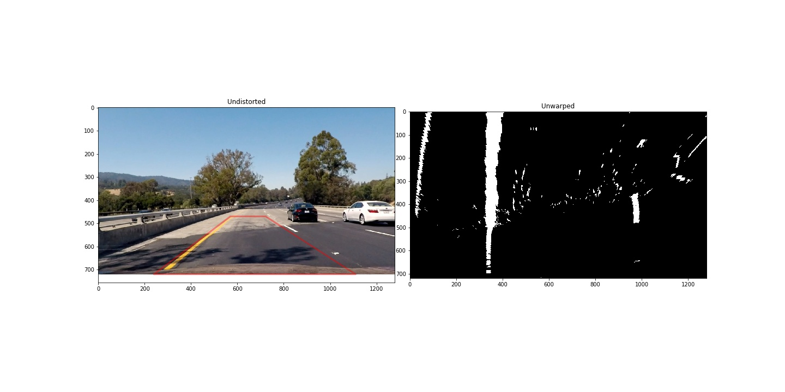

## Project: Advanced Lane Lines
[](http://www.udacity.com/drive)
---
---

**Advanced Lane Finding Project**

The goals / steps of this project are the following:

* Compute the camera calibration matrix and distortion coefficients given a set of chessboard images.
* Apply a distortion correction to raw images.
* Use color transforms, gradients, etc., to create a thresholded binary image.
* Apply a perspective transform to rectify binary image ("birds-eye view").
* Detect lane pixels and fit to find the lane boundary.
* Determine the curvature of the lane and vehicle position with respect to center.
* Warp the detected lane boundaries back onto the original image.
* Output visual display of the lane boundaries and numerical estimation of lane curvature and vehicle position.

[//]: # (Image References)

[image1]: ./examples/undistort_output.png "Undistorted"
[image2]: ./test_images/test1.jpg "Road Transformed"
[image3]: ./examples/binary_combo_example.jpg "Binary Example"
[image4]: ./examples/warped_straight_lines.jpg "Warp Example"
[image5]: ./examples/color_fit_lines.jpg "Fit Visual"
[image6]: ./examples/example_output.jpg "Output"
[video1]: ./project_video.mp4 "Video"

## [Rubric](https://review.udacity.com/#!/rubrics/571/view) Points

### Here I will consider the rubric points individually and describe how I addressed each point in my implementation.  

---

### Writeup / README

#### 1. Provide a Writeup / README that includes all the rubric points and how you addressed each one.  You can submit your writeup as markdown or pdf.  [Here](https://github.com/udacity/CarND-Advanced-Lane-Lines/blob/master/writeup_template.md) is a template writeup for this project you can use as a guide and a starting point.  

You're reading it!

### Camera Calibration

#### 1. Briefly state how you computed the camera matrix and distortion coefficients. Provide an example of a distortion corrected calibration image.

In this project, I assume that the chessboard are fixed as 2D so that z=0. So basically all the chessboard corners are same for different images. So firstly, all the images have been converted to gray color method and find the corners. For each of the corners found, the pixel coordinates informations will be stored in `imgpoints`. 

I then used the output `objpoints` and `imgpoints` to compute the camera calibration and distortion coefficients using the `cv2.calibrateCamera()` function.  I applied this distortion correction to the test image using the `cv2.undistort()` function and obtained this result: 


### Pipeline (single images)

#### 1. Provide an example of a distortion-corrected image.

To demonstrate this step, I will describe how I apply the distortion correction to one of the test images like this one:


#### 2. Describe how (and identify where in your code) you used color transforms, gradients or other methods to create a thresholded binary image.  Provide an example of a binary image result.

I used a combination of color, gradient and direction thresholds to generate a binary image. Here's an example of my output for this step.  (note: this is not actually from one of the test images)


#### 3. Describe how (and identify where in your code) you performed a perspective transform and provide an example of a transformed image.

The code for my perspective transform in the `unwarp()` function and 12rd code cell of the IPython notebook.  The `unwarp()` function takes as inputs an image (`img`), as well as source (`src`) and destination (`dst`) points.  I chose the hardcode the source and destination points in the following manner:

```python
src = np.float32([(240,720),
                  (1110,720), 
                  (570,470), 
                  (722,470)])
dst = np.float32([(320,720),
                  (920,720),
                  (320,1),
                  (920,1)])
```

I verified that my perspective transform was working as expected by drawing the `src` and `dst` points onto a test image and its warped counterpart to verify that the lines appear parallel in the warped image.




#### 4. Describe how (and identify where in your code) you identified lane-line pixels and fit their positions with a polynomial?

Then I did some other stuff and fit my lane lines with a 2nd order polynomial with functions `find_lane_pixels()` and `fit_polynomial()`:


Then I tried to find the fit based on the previous fit with the function `polyfit_prev()`:


#### 5. Describe how (and identify where in your code) you calculated the radius of curvature of the lane and the position of the vehicle with respect to center.

I did this with function `radius()`

#### 6. Provide an example image of your result plotted back down onto the road such that the lane area is identified clearly.

I implemented this step through function `draw_lane()`.  Here is an example of my result on a test image:


---

### Pipeline (video)

#### 1. Provide a link to your final video output.  Your pipeline should perform reasonably well on the entire project video (wobbly lines are ok but no catastrophic failures that would cause the car to drive off the road!).

Here's a [video result](./output_video/project_output.mp4)

And videos for challange one:

[challange video result](./output_video/challenge_output.mp4)

And harder challange one:

[harder challange video result](./output_video/harder_challenge_output.mp4)

---

### Discussion

#### 1. Briefly discuss any problems / issues you faced in your implementation of this project.  Where will your pipeline likely fail?  What could you do to make it more robust?

When I did this project, I start from the begining a few times because the detection of the lines are highly sensitive of the parameters chosen for different selection methods. And I also tried to distorted the picture before apply the selection thresholds. Somehow it seems to be more sensitive and failed more easily. Moreover, there should be multiple ways to select the lines that work, but if only apply color selection. Eventhough it may work fine with the test pictures, it will be easily failed when there are short white lines occured in the video. There must be a better way for the selection than I did. But this is the only way I tried that can work. Also, the polynomial fit in my code does not work perfect when apply to the challenge and harder challenge videos. 
